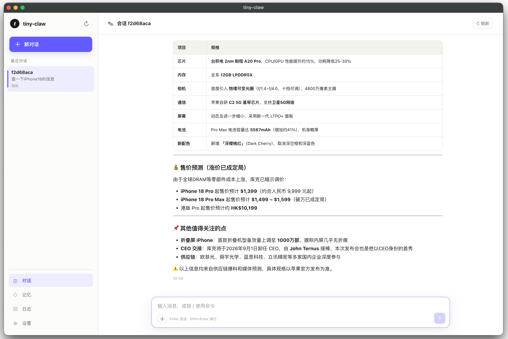

## 关于本仓库
tiny-claw 是一个插件化、可扩展的个人 AI Agent 框架，用于研究Agent实现原理，实现了一个完整Agent的全部功能，支持工具调用、长期记忆、权限审批、Web UI 和飞书接入。
这个项目的目的是研究Agent实现原理，并未经过严格测试，因此可能存在一些潜在的问题，不建议部署在生产环境中。



## 快速开始

### 安装

```bash
git clone https://github.com/lihongxun945/tiny-claw.git
cd tiny-claw
npm install
```

### 配置模型

首次启动 Gateway 或桌面应用时，如果 workspace 中没有 `config.json`，tiny-claw 会自动生成一份完整的默认配置。可以直接在 WebUI 的“配置”页面填写 API Key、模型、搜索、权限、记忆、Sub-agent 和插件等全部设置。

也可以在启动前手动复制配置模板：

```bash
cp config.simple.example.json workspace/config.json
```

推荐从 `config.simple.example.json` 开始；`config.all.example.json` 是完整配置参考。
自动生成的配置会预设 DeepSeek API 地址、`deepseek-chat` 模型和可直接使用的 DuckDuckGo 关键词搜索；API Key、飞书密钥和付费搜索服务密钥等用户凭证保持为空。API Key 未配置时 Gateway 和 WebUI 仍可启动，但聊天会提示先完成模型配置。

`workspace/config.json` 必填字段：

```json
{
  "apiUrl": "https://ark.cn-beijing.volces.com/api/coding",
  "apiKey": "YOUR_API_KEY",
  "model": "glm-5.1",
  "modelProvider": "anthropic-messages"
}
```

`modelProvider` 用于选择模型协议适配器。当前支持：

| modelProvider | 协议 |
|---|---|
| `anthropic-messages` | Anthropic Messages API 兼容协议 |
| `openai-chat` / `chatgpt` | OpenAI Chat Completions 兼容协议 |

### 配置搜索引擎

Agent 的 `web_search` 能力依赖搜索 provider。`duckduckgo` 是免配置兜底，只适合简单关键词查询，本质上不是真正稳定的搜索引擎能力，效果较差；推荐配置 Ollama Web Search、Brave Search 或自建 SearXNG。

Ollama Web Search 示例：

```json
{
  "searchProvider": "ollama",
  "ollamaApiKey": "YOUR_OLLAMA_API_KEY"
}
```

Brave Search 示例：

```json
{
  "searchProvider": "brave",
  "braveApiKey": "YOUR_BRAVE_API_KEY"
}
```

SearXNG 示例：

```json
{
  "searchProvider": "searxng",
  "searxngUrl": "http://localhost:8080"
}
```

### 启动 Gateway

推荐使用 Gateway + WebUI 模式进行本地使用和开发：

```bash
npm run web:build
npm run gateway -- --port 3000
```

Gateway API 默认监听 `127.0.0.1:3000`，WebUI 默认访问：

```text
http://localhost:3001
```

启动后即可在 WebUI 中创建会话并与 Agent 对话。

注意：`npm run gateway` 会以 daemon 模式启动 Gateway。daemon 模式只有在 `web/dist/index.html` 已存在时才会启动 WebUI 静态服务；首次启动、刚拉代码或清理过构建产物后，需要先执行 `npm run web:build`，再启动或重启 Gateway。否则可能只启动了 Gateway API，`http://localhost:3001` 会提示无法访问。

前端开发时也可以单独启动 Vite dev server：

```bash
npm run gateway -- --port 3000
npm run web:dev
```

### 使用 macOS 客户端

#### 下载与安装

从 GitHub Releases 下载 `tiny-claw-<version>-arm64.dmg`，打开 DMG 后将 `tiny-claw.app` 拖入“应用程序”目录。当前客户端仅支持 Apple Silicon Mac。

#### 首次配置

客户端首次启动会自动创建完整的默认配置。打开左下角“配置”页面，至少完成以下设置：

1. 填写模型服务的 API URL。
2. 填写 API Key。
3. 填写模型名称。
4. 选择模型协议：`anthropic-messages` 或 `openai-chat`。
5. 按需配置 Ollama Web Search、Brave Search 或 SearXNG。
6. 点击“保存”。

模型配置保存后，新会话会自动使用最新设置。插件启停、Gateway Host 和 Gateway Token 等启动期配置需要退出并重新打开客户端后生效。

客户端运行后会在 macOS 菜单栏显示 tiny-claw 图标。关闭主窗口只会隐藏窗口，Agent 和 Gateway 会继续在后台运行；点击菜单栏图标、Dock 图标或再次打开应用即可恢复窗口。需要完全退出时，请在菜单栏图标的菜单中选择“退出 tiny-claw”，或按 `Command+Q`。

#### 日常使用

- 在“聊天”页面输入任务并发送，Agent 会根据任务调用工具并流式输出结果。
- 点击“新对话”创建新会话；历史会话会显示在左侧列表中。
- 在“记忆”页面查看、编辑、禁用或删除长期记忆。
- 在“日志”页面查看运行日志、模型调用错误和工具审计记录。
- 在“配置”页面修改模型、上下文、搜索、权限、Sub-agent、插件和调试设置。
- 当工具需要审批时，在聊天消息的工具块中点击“批准”或“拒绝”；批准后原任务会自动继续执行。

#### 数据与升级

macOS 客户端的所有用户数据保存在：

```text
~/Library/Application Support/tiny-claw/workspace
```

其中包含配置、会话、长期记忆、Skill、插件和日志。覆盖安装或升级客户端不会清除该目录，建议在迁移电脑前备份整个 workspace。

客户端 workspace 与源码仓库中的 `./workspace` 相互独立，客户端不会自动读取源码开发环境的数据。如需迁移，可以在客户端完全退出后，将需要的配置、会话、记忆、Skill 或插件复制到客户端 workspace。

### 构建 macOS 应用

在 Apple Silicon Mac 上构建 DMG：

```bash
npm run desktop:dist
```

如果登录钥匙串中存在有效的 `Developer ID Application` 证书及私钥，`electron-builder` 会自动签名应用；否则生成未签名的本地测试包。安装包输出到 `release/tiny-claw-<version>-arm64.dmg`。桌面版首次启动会在 `~/Library/Application Support/tiny-claw/workspace` 创建独立工作目录和完整默认配置；打开应用后，可在“配置”页面完成所有设置。

### 通过 Tag 自动发布

推送与 `package.json` 版本一致的 `v*` Tag 后，GitHub Actions 会自动运行测试、使用 Developer ID 签名 arm64 应用、提交 Apple 公证、装订公证票据并创建 GitHub Release：

```bash
npm version patch
git push origin HEAD --follow-tags
```

例如 `package.json` 版本为 `0.2.0` 时，Tag 必须是 `v0.2.0`。发布产物包含已签名并公证的 DMG、blockmap 和 `SHA256SUMS.txt`。仓库需要预先配置 `MACOS_CERTIFICATE`、`MACOS_CERTIFICATE_PASSWORD`、`APPLE_ID`、`APPLE_APP_SPECIFIC_PASSWORD` 和 `APPLE_TEAM_ID` 五个 Actions Secrets。

## 配置参考

`workspace/config.json` 支持以下配置。`workspacePath` 和 `systemPrompt` 是运行时内部字段，不需要写入配置文件。

| 配置项 | 默认值 | 示例 | 说明 |
|---|---:|---|---|
| `apiUrl` | 必填 | `"https://ark.cn-beijing.volces.com/api/coding"` | 模型 API 基础地址 |
| `apiKey` | 必填 | `"YOUR_API_KEY"` | 模型 API Key |
| `model` | 必填 | `"deepseek-v4-flash"` | 模型名称 |
| `modelProvider` | `"anthropic-messages"` | `"openai-chat"` | 模型协议适配器：`anthropic-messages`、`openai-chat`、`chatgpt` |
| `maxTokens` | `4096` | `4096` | 单次模型回复最大 token |
| `maxContextTokens` | `128000` | `128000` | 上下文窗口 token 估算上限 |
| `contextCompressionThreshold` | `0.7` | `0.7` | 超过 `maxContextTokens * threshold` 时触发上下文压缩 |
| `contextCompressionMaxChars` | `5000` | `5000` | 上下文压缩摘要目标字数上限 |
| `contextCompressionToolResultMaxChars` | `500` | `500` | 构建历史压缩摘要时每个 tool result 保留的字符数 |
| `toolResultInitialMaxChars` | `12000` | `12000` | 对话上下文超预算时 tool result 的初始截断字符数 |
| `historyWindowSize` | `5` | `20` | 普通历史窗口轮数；会话摘要开启后仍会保留近期原文 |
| `maxAgentIterations` | `20` | `20` | 单次任务最大 Agent Loop 次数；配置 `0` 表示不限 |
| `searchProvider` | `"ollama"` | `"brave"` | 搜索服务：`ollama`、`searxng`、`brave`、`duckduckgo` |
| `ollamaApiKey` | 无 | `"YOUR_OLLAMA_API_KEY"` | Ollama Web Search API Key，`searchProvider=ollama` 时使用 |
| `searxngUrl` | 无 | `"http://localhost:8080"` | 自建 SearXNG 地址，`searchProvider=searxng` 时使用 |
| `braveApiKey` | 无 | `"YOUR_BRAVE_API_KEY"` | Brave Search API Key，`searchProvider=brave` 时使用 |
| `enabledPlugins` | `[]` | `["feishu"]` | 启用的内置插件列表 |
| `externalPlugins` | `[]` | `["./workspace/plugins/foo/index.ts"]` | 额外加载的外部插件入口 |
| `plugins` | `{}` | `{ "feishu": { "appId": "cli_xxx" } }` | 插件私有配置 |
| `subAgent` | 见下文 | `{ "maxConcurrency": 3 }` | Sub-agent 工具权限与并发配置 |
| `sessionSummary` | 见下文 | `{ "enabled": true }` | 会话滚动摘要与持久化配置 |
| `autoMemory` | 见下文 | `{ "mode": "hybrid" }` | 自动长期记忆配置 |
| `memory` | 见下文 | `{ "maxTotalChars": 80000 }` | 长期记忆单条与总容量限制 |
| `debug` | `false` | `{ "enabled": true, "modelIO": true }` | 模型输入输出调试日志 |
| `security` | 见下文 | `{ "bash": { "mode": "allow" } }` | bash、Gateway、工具审计安全配置 |

### Sub-agent 配置

`sub_agent_run` 工具支持一次并行启动多个临时子 agent。子 agent 默认只开放读取/检索类工具，不允许执行 shell、写文件或保存记忆。可在 `workspace/config.json` 中调整：

```json
{
  "subAgent": {
    "allowedTools": ["web_search", "web_fetch", "file_read", "memory_list", "memory_read", "skill_list", "skill_use"],
    "disabledTools": ["bash", "file_write", "file_edit", "memory_save", "memory_append", "memory_delete", "sub_agent_run"],
    "maxIterations": 3,
    "maxConcurrency": 3
  }
}
```

如果需要让子 agent 具备更多能力，可以把工具名加入 `allowedTools`，再确保不在 `disabledTools` 中。`sub_agent_run` 会始终被禁用，避免递归派生。

Sub-agent 提示词默认模板位于 `src/prompts/sub_agent.md`，可在工作目录放置 `workspace/sub_agent_prompt.md` 覆盖。支持占位符：`{{task}}`、`{{context}}`、`{{allowed_tools}}`、`{{current_date}}`。

| 配置项 | 默认值 | 示例 | 说明 |
|---|---:|---|---|
| `subAgent.allowedTools` | 读取/检索类工具 | `["web_search", "file_read"]` | 子 agent 可使用的工具白名单 |
| `subAgent.disabledTools` | `["sub_agent_run"]` | `["bash", "file_write"]` | 子 agent 禁用工具；`sub_agent_run` 始终禁用 |
| `subAgent.maxIterations` | `3` | `3` | 单个子任务最大 Agent Loop 次数，上限 `8` |
| `subAgent.maxConcurrency` | `3` | `3` | 并行执行的子任务数量，上限 `8` |

### 会话摘要配置

`core-session-summary` 插件会为每个普通会话维护滚动摘要，模型调用时注入摘要并只保留最近几轮原文，避免历史消息持续膨胀。摘要默认持久化到 `workspace/sessions/<session>/state.json`，刷新、切换会话或重启 Gateway 后仍可恢复：

```json
{
  "sessionSummary": {
    "enabled": true,
    "persistent": true,
    "turnThreshold": 5,
    "recentTurns": 3,
    "maxChars": 4000
  }
}
```

`sub:` 开头的临时 sub-agent 会话默认不生成摘要，避免额外消耗。完整原始消息按会话写入 `workspace/sessions/<session>/messages.jsonl`，持久摘要只作为模型上下文状态，不影响 UI 历史回放。

| 配置项 | 默认值 | 示例 | 说明 |
|---|---:|---|---|
| `sessionSummary.enabled` | `true` | `true` | 是否启用会话滚动摘要 |
| `sessionSummary.persistent` | `true` | `true` | 是否把摘要持久化到 session 状态文件 |
| `sessionSummary.turnThreshold` | `5` | `5` | 累积多少轮后更新一次摘要 |
| `sessionSummary.recentTurns` | `3` | `3` | 模型上下文中保留的最近原文轮数 |
| `sessionSummary.maxChars` | `4000` | `4000` | 会话滚动摘要最大字符数 |

### 自动记忆配置

`core-auto-memory` 可以在多轮对话后自动整理长期记忆：新增稳定记忆、更新已有记忆，压缩碎片化记忆，并在允许时删除过期记忆。每轮最终问答会先按 session 持久化到 `state.json`，但触发和整理是 workspace 级的：达到阈值或执行 `/dream` 时，会聚合所有主会话的待整理增量一起处理。长期记忆存储在 `workspace/memory/*.md`，不同于会话摘要；它更适合保存用户偏好、项目约定等跨会话信息。未禁用的长期记忆会以全文形式注入 system prompt，`memory_list` 仍返回摘要索引，避免工具结果过大。

```json
{
  "autoMemory": {
    "enabled": true,
    "mode": "hybrid",
    "turnThreshold": 10,
    "maxCandidates": 5,
    "maxBatchChars": 8000,
    "lockTimeoutSeconds": 300
  },
  "memory": {
    "maxItemChars": 20000,
    "maxTotalChars": 80000
  }
}
```

| 配置项 | 默认值 | 示例 | 说明 |
|---|---:|---|---|
| `autoMemory.enabled` | `true` | `true` | 是否启用自动记忆 |
| `autoMemory.mode` | `"hybrid"` | `"hybrid"` | `auto` 开放保存/更新/删除；`hybrid` 只开放保存/更新，删除只建议；`suggest` 只读并输出建议 |
| `autoMemory.turnThreshold` | `10` | `10` | workspace 内累计多少轮主会话最终问答后触发一次分析 |
| `autoMemory.maxCandidates` | `5` | `5` | 单次最多允许的 memory 工具调用次数 |
| `autoMemory.maxBatchChars` | `8000` | `8000` | 单次分析中增量对话的最大字符数；已有启用记忆始终全文输入 |
| `autoMemory.lockTimeoutSeconds` | `300` | `300` | workspace 记忆整理锁的过期时间 |
| `memory.maxItemChars` | `20000` | `20000` | 单条记忆正文最大字符数 |
| `memory.maxTotalChars` | `80000` | `80000` | 所有启用记忆正文的总字符上限 |

自动记忆整理会把“已保存长期记忆全文 + workspace 内上次成功整理后累计的用户问题和最终回答 + 配置的长度限制”一起交给整理模型，不包含中间工具调用、工具结果或调试日志。每条待整理对话有唯一 ID；整理成功后只清除本次快照包含的 ID，因此整理期间新增的对话会保留到下一次。workspace 整理锁避免多个 Gateway 或桌面实例同时修改记忆。整理模型直接调用已有 `memory_*` 工具；写入超过单条或总容量限制时工具会要求模型压缩重试，不会截断内容后保存。

### 聊天命令

聊天输入支持斜杠命令。命令由插件注册；在 WebUI 输入 `/` 时会显示当前已注册命令，支持按名称或别名过滤，并可使用方向键、Tab 或 Enter 补全。内置命令如下：

| 命令 | 说明 |
|---|---|
| `/help` | 列出可用命令 |
| `/help <命令名>` | 查看单个命令说明 |
| `/new` | Web 中开启新会话；飞书中重置当前会话 |
| `/reset` | `/new` 的别名 |
| `/context` | 显示当前会话上下文长度估算 |
| `/ctx` | `/context` 的别名 |
| `/dream` | 立即触发 workspace 级 auto-memory 整理 |
| `/approvals` | 列出当前可处理的命令审批 |
| `/approve <审批 ID>` | 批准一条命令审批；可恢复原任务时会继续执行 |
| `/approve-all <审批 ID>` | 允许当前对话轮次后续所有 `ask` 权限申请并继续执行 |
| `/reject <审批 ID>` | 拒绝一条命令审批 |

自定义插件可以通过 `ctx.registerChatCommand(...)` 注册命令。命令会在进入 Agent Loop 前执行，适合做会话管理、审批、上下文查询等轻量操作。

### 图片输入

WebUI 支持选择图片或直接粘贴截图，可在发送前预览和移除。图片按 session 保存在 `workspace/sessions/<session>/attachments/`，历史记录只保存附件引用；需要使用支持视觉输入的模型。默认支持 PNG、JPEG、WebP 和 GIF，每条消息最多 4 张、单张不超过 10 MB。

| 配置项 | 默认值 | 示例 | 说明 |
|---|---:|---|---|
| `attachments.enabled` | `true` | `true` | 是否允许上传图片 |
| `attachments.maxFilesPerMessage` | `4` | `4` | 每条消息最多携带的图片数 |
| `attachments.maxFileSize` | `10485760` | `10485760` | 单张图片最大字节数 |
| `attachments.allowedImageTypes` | PNG/JPEG/WebP/GIF | `["image/png","image/jpeg"]` | 允许上传的图片 MIME 类型 |

### Debug 模式

需要查看大模型调用的原始输入/输出时，可以在 `workspace/config.json` 中开启：

```json
{
  "debug": {
    "enabled": true,
    "modelIO": true,
    "rawStreamEvents": true
  }
}
```

开启后，每次模型调用会按 Request ID 写入
`workspace/debug/model-calls/YYYY-MM-DD/<requestId>.json`。在 Web UI 的“日志 → 模型调用”中可以按调用查看：

- 请求原文：发送给模型的 URL 和请求体，包括 system prompt、messages、tools
- 响应原文：非流式接口返回的原始 JSON
- 解析结果：tiny-claw 解析后的文本和工具调用
- 错误与修复：失败响应、自动修复策略和重试请求，归入同一个 Request ID
- 流事件：流式接口返回的原始 SSE JSON 事件（仅在 `rawStreamEvents` 开启时记录）

认证请求头不会写入调试记录，图片 Base64 数据也会被替换为占位说明。请求体仍可能包含用户输入、工具结果、system prompt 和记忆内容，建议只在本地排查时开启。

| 配置项 | 默认值 | 示例 | 说明 |
|---|---:|---|---|
| `debug` | `false` | `true` | 简写形式，直接开启或关闭 debug |
| `debug.enabled` | `false` | `true` | 是否启用 debug 日志 |
| `debug.modelIO` | `true` | `true` | debug 开启后，是否记录模型请求和响应 |
| `debug.rawStreamEvents` | `true` | `true` | debug 开启后，是否记录流式原始事件 |

### 安全边界

文件工具支持读取和修改 workspace 之外的文件：相对路径以 workspace 为基准，也可以传入绝对路径。危险操作默认自动执行；如果需要更严格的安全边界，可以通过全局模式或工具级模式改为 `ask` / `deny`：

```json
{
  "security": {
    "mode": "allow",
    "tools": {
      "bash": { "mode": "ask" },
      "file_write": { "mode": "ask" },
      "memory_delete": { "mode": "deny" }
    },
    "auditTools": true
  }
}
```

权限决策顺序为：`security.tools.<tool>.mode` > `security.mode` > `allow`。`bash` 工具和技能文件中的动态 shell 注入都使用 `bash` 的工具级权限。`ask` 会创建一次性审批记录；Web UI 可以“批准本次”或“允许本轮”，飞书中可以回复完整 `/approve <审批 ID>` 或 `/approve-all <审批 ID>`，批准后都会尝试继续原会话。“允许本轮”仅对当前 session、调用者和当前 Agent Loop 生效，本轮完成、失败或取消后自动清理，且不会覆盖 `deny`。工具调用默认写入审计日志，可通过 `auditTools: false` 关闭。

| 配置项 | 默认值 | 示例 | 说明 |
|---|---:|---|---|
| `security.mode` | `"allow"` | `"ask"` | 全局危险操作权限模式：`deny`、`ask`、`allow` |
| `security.tools.<tool>.mode` | 继承全局 | `"deny"` | 单个工具权限模式，覆盖 `security.mode` |
| `security.gateway.host` | `"127.0.0.1"` | `"0.0.0.0"` | Gateway 监听地址；暴露到非回环地址时必须配置 token |
| `security.gateway.token` | 无 | `"YOUR_GATEWAY_TOKEN"` | Gateway Bearer token |
| `security.gateway.sseHeartbeatIntervalMs` | `15000` | `15000` | 流式响应空闲时发送 SSE 心跳的间隔，避免长时间推理导致连接超时 |
| `security.auditTools` | `true` | `true` | 是否记录工具调用审计日志 |

### Gateway API

Gateway 默认只监听 `127.0.0.1`。如需暴露到其他机器，请同时配置 Bearer token：

```json
{
  "security": {
    "gateway": {
      "host": "0.0.0.0",
      "token": "YOUR_GATEWAY_TOKEN"
    }
  }
}
```

外部 API 请求需携带 `Authorization: Bearer YOUR_GATEWAY_TOKEN`。Web UI 仍只监听本机回环地址。

启动 HTTP API 服务，支持外部客户端通过 SSE 流式调用 Agent：

| 方法 | 路径 | 说明 |
|------|------|------|
| POST | /chat | 发送消息（SSE 流式响应） |
| GET | /sessions | 列出活跃会话 |
| DELETE | /sessions/:id | 销毁会话 |
| POST | /sessions/:id/cancel | 取消会话中正在运行的任务 |
| GET | /approvals | 列出命令审批记录 |
| POST | /approvals/:id/approve | 允许相同命令执行一次 |
| POST | /approvals/:id/approve-turn-and-resume | 允许本轮后续 `ask` 权限并继续原任务（SSE） |
| POST | /approvals/:id/reject | 拒绝命令执行 |
| GET | /memory | 列出长期记忆 |
| PUT | /memory/:name | 更新长期记忆 |
| DELETE | /memory/:name | 删除长期记忆 |

POST /chat 请求示例：

```json
{ "message": "你好", "session_id": "optional" }
```

聊天输入支持插件注册的斜杠命令。输入 `/help` 可查看当前可用命令；输入 `/new` 可开启新会话；输入 `/context` 可查看当前上下文长度估算；输入 `/dream` 可立即触发 workspace 级 auto-memory 整理。

同一 session 同一时间只允许执行一个任务。客户端断开 SSE 连接时，Gateway 会自动取消后台任务；已知 session 也可以通过 `/sessions/:id/cancel` 主动取消。默认最多执行 20 次 Agent Loop 迭代，可通过 `maxAgentIterations` 调整，显式配置 `0` 表示不限。

### 飞书机器人配置

1. **创建飞书自建应用** — 前往 [飞书开放平台](https://open.feishu.cn/app) 创建应用，获取 `App ID` 和 `App Secret`

2. **配置事件订阅** — 在应用后台 → 事件与回调：
   - 订阅方式选择 **长连接**
   - 添加事件 `im.message.receive_v1`（接收消息）

3. **开启机器人能力** — 在应用后台 → 应用能力 → 机器人，开启机器人能力

4. **配置权限** — 在应用后台 → 权限管理，添加以下权限：
   - `im:message` — 获取与发送消息
   - `im:message.reaction` — 消息表情

5. **发布应用** — 创建版本并发布

6. **修改配置文件** — 在 `workspace/config.json` 中添加飞书插件配置：

```json
{
  "enabledPlugins": ["feishu"],
  "plugins": {
    "feishu": {
      "appId": "cli_xxx",
      "appSecret": "xxx",
      "verificationToken": "xxx"
    }
  }
}
```

| 配置项 | 默认值 | 示例 | 说明 |
|---|---:|---|---|
| `enabledPlugins` | `[]` | `["feishu"]` | 启用飞书内置插件 |
| `plugins.feishu.appId` | 必填 | `"cli_xxx"` | 飞书自建应用 App ID |
| `plugins.feishu.appSecret` | 必填 | `"YOUR_FEISHU_APP_SECRET"` | 飞书自建应用 App Secret |
| `plugins.feishu.verificationToken` | 必填 | `"YOUR_FEISHU_VERIFICATION_TOKEN"` | 事件订阅 Verification Token |

7. **确认连接** — 先按“快速开始”确保 Gateway 已运行；飞书插件会随 Gateway 自动建立 WebSocket 长连接。

启动后日志显示 `飞书长连接已建立` 即表示连接成功，可以在飞书中给机器人发消息测试。

当相关工具权限为 `ask` 时，飞书用户可以直接发送文字命令处理自己发起的审批：

| 命令 | 说明 |
|------|------|
| `/approvals` | 列出当前用户在当前会话中可以处理的审批 |
| `/approve <审批 ID>` | 批准审批，并尝试继续原会话任务 |
| `/approve-all <审批 ID>` | 允许本轮全部权限申请，并尝试继续原会话任务 |
| `/reject <审批 ID>` | 拒绝命令执行 |

飞书审批绑定发起用户和会话。批准后会继续原会话中暂停的工具调用；其他用户无法查看、批准或拒绝该审批。

## 插件开发

tiny-claw 采用插件化架构，所有业务逻辑由插件实现。框架通过 `PluginManager` 统一调度插件生命周期和钩子。

用户自定义插件只需放在 `workspace/plugins/<name>/index.ts`，启动时自动加载，无需修改配置。

插件开发详细文档请参考 [docs/plugin-development.md](docs/plugin-development.md)，包含：

- `Plugin` / `PluginContext` 接口说明
- 8 个生命周期钩子的触发时机和用途
- 快速创建插件的完整示例
- 自定义工具和斜杠聊天命令注册示例
- 注册工具、HTTP 路由的代码示例
- 配置读写方式
- 核心插件和飞书插件作为实战参考

## 技术栈
- 主要编程语言：**TypeScript**（项目涉及大量消息格式、工具 schema、API 响应等结构化数据，类型安全能显著减少 bug）

## 功能

### 基础能力（主链路）

1. [x] **Main Loop** — 规划-执行-观察循环，直到任务完成
   - 终止条件：任务完成、模型判断无法继续、用户中断
   - 异常处理：执行失败时重试或换策略，单次循环最大步数限制
2. [x] **Model IO + Prompt** — 调用大模型，管理提示词
   - Prompt 管理：使用模板和上下文构造提示词
   - Model 调用：发送 prompt，获取响应
   - 流式输出：支持 streaming
3. [x] **工具调用** — 脚本执行、文件读写等
   - 声明式工具注册：使用 JSON Schema 定义工具的参数和描述（类似 OpenAI function calling）
   - 工具发现：自动发现和注册可用工具
   - 内置工具：web_search、web_fetch、bash、file_read、file_write、file_edit、memory_save、memory_append、memory_list、memory_read、memory_delete、skill_use、skill_list、sub_agent_run
4. [x] **History** — 历史消息管理
5. [x] **日志** — 方便排查问题
6. [x] **上下文压缩** — 长任务导致上下文溢出时自动压缩
7. [x] **配置管理** — 模型选择、API key、工具权限等配置的统一管理
8. [x] **聊天指令** 通过输入 /xxxx 执行指令，比如 /new_session 开启新session

### 高级能力

1. [x] **Memory** — 持久化记忆（工具驱动，读写 memory/*.md）
2. [x] **Skill** — 技能系统，支持可插拔的专项能力（skills/<name>/SKILL.md）
3. [x] **网关** — HTTP Gateway（SSE 流式 API、会话管理）
4. [x] **插件系统** — 内置/外部插件加载，路由注册，生命周期管理
5. [x] **基础权限边界** — 文件工具支持 workspace 外路径；bash 支持 `allow`/`ask`/`deny` 权限模式；Gateway 默认仅本机监听并支持 token 鉴权
6. [x] **模式切换** — 可以以不同模式执行任务，比如 询问模式、自动模式、计划模式等。
7. [x] **飞书接入** — 飞书机器人（WebSocket 长连接模式）
8. [ ] **心跳** — 定时启动，执行定期任务
9. [x] **Web UI** — 基于 Gateway 的前端界面
10. [ ] **多Agent** - 多agent，互相隔离，不同的工作目录和上下文
11. [x] **SubAgent** - 并行执行子任务的临时 sub-agent，默认只读权限，可配置工具白名单/黑名单
12. [ ] **RAG** — 检索增强生成
13. [ ] **进程沙箱** — 通过容器或受限进程执行脚本


## 与 Open-Claw 的对比

| 功能模块 | tiny-claw | open-claw |
|---------|-----------|-----------|
| **Agent Loop** | 自实现规划-执行-观察循环，`AgentSession` 管理多会话 | 内置 Loop 引擎，架构相似 |
| **Prompt 管理** | 手动构造 system prompt + `identity.md` 注入 | 内置 prompt 模板系统 |
| **工具系统** | `ToolRegistry` + JSON Schema 声明式注册，15 个内置工具 | Plugin SDK 驱动，工具通过插件注册 |
| **上下文压缩** | 模型摘要压缩，滑动窗口历史 | 有类似机制 |
| **Memory** | 工具驱动，文件存储 `memory/*.md` | 独立的 Memory 模块 |
| **Skill 系统** | `workspace/skills/<name>/SKILL.md` + frontmatter | 插件形式的技能系统 |
| **HTTP Gateway** | 自定义实现，SSE 流式 + 会话管理 | 内置 Gateway 模块 |
| **飞书接入** | 简化实现，直接使用 `@larksuiteoapi/node-sdk` WSClient | 官方 `@larksuite/openclaw-lark` 插件 |
| **插件系统** | 自定义 Plugin 接口 + 路由注册表，~100 行 | 完整 Plugin SDK，18 个子模块 |
| **权限沙箱** | 未实现 | 有 sandbox 模块 |
| **Web UI** | React + Vite 前端，基于 Gateway SSE | 有 Web UI |
| **RAG** | 未实现 | RAG 模块 |
| **代码规模** | ~20 个源文件，轻量聚焦 | 企业级，功能全面 |
| **外部依赖** | 极少（仅 `@larksuiteoapi/node-sdk`） | 重型（Plugin SDK 等） |
| **模型支持** | 兼容 Anthropic Messages API（可对接火山方舟等） | Anthropic Messages API |
| **多租户** | `AgentSession` + `session_id` 隔离 | Session 管理 |

### 设计哲学差异

- **tiny-claw** 追求极简——零运行时依赖、核心逻辑自实现、代码量小、易于理解和修改。适合学习、个人项目或定制化场景。
- **open-claw** 追求企业级完备性——丰富的插件生态、完善的权限管理、开箱即用的多平台支持。适合团队协作、生产环境部署。
- **插件兼容**：当前插件系统为简化自实现，后续计划逐步兼容 open-claw 的插件规范，最终能复用其插件生态。
