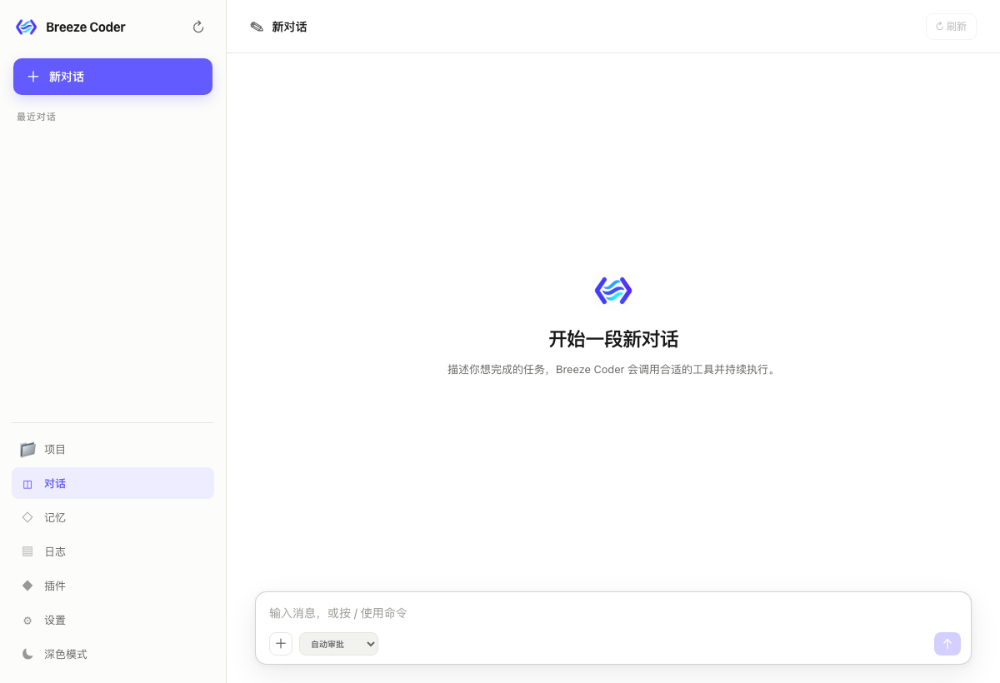

# Breeze Coder


**让编程如沐清风。**

Breeze Coder 是一个插件化、可扩展的个人 AI 编程助手。它可以理解项目、检索资料、编辑代码并执行任务，通过可选的规划工具展示目标、步骤和进度，让复杂工作更轻松、更清晰。



## 特点

- **桌面即用**：提供 macOS 和 Windows 客户端，无需手动启动服务；也支持 Web UI 和飞书接入。
- **项目开发**：打开本地项目，自动加载项目规则与技能，支持代码搜索、文件编辑、Shell 和 Git 操作。
- **模型自由选择**：连接远程模型，或下载 Qwen、Gemma 本地模型，在本机运行。
- **任务进度可见**：按需规划目标和步骤，支持主动提问、权限审批及后台通知。
- **持久记忆**：结合向量检索的长期记忆、会话记忆和上下文整理，让后续对话延续已有信息。
- **交互与调试**：支持图片输入、流式回复恢复、上下文查看、模型请求与工具调用日志。
- **灵活扩展**：通过插件、Skill 和 Sub-agent 扩展能力。

## 使用指南

### 下载安装

推荐使用客户端。前往本仓库的 **Releases** 页面，选择对应系统的安装包：

- **macOS（Apple Silicon）**：下载 `breeze-coder-<version>-arm64.dmg`，打开后将 `Breeze Coder.app` 拖入“应用程序”。
- **Windows（x64）**：下载 `breeze-coder-<version>-windows-x64-setup.exe`，按照安装向导完成安装。当前 Windows 版本未签名，请确认下载来源并核对发布页提供的校验值，不要关闭系统防护。

Windows 如需执行 Shell 命令，请安装 [Git for Windows](https://gitforwindows.org/) 后重启客户端。

### 必要配置

首次启动会自动初始化配置，但不会附带可用的远程服务密钥。打开设置，至少配置一个可用模型；以下操作都可在界面中完成，无需手动修改配置文件。

#### 远程模型

在“远程模型”中编辑已有配置，或点击“添加远程模型”。先从模型服务商获取 API 地址、密钥和可用模型 ID，再填写：

| 字段 | 如何填写 | 填写示例 |
| --- | --- | --- |
| ID | 当前应用内唯一的配置标识，不是服务商的模型名称 | `remote-main` |
| 名称 | 便于在聊天中识别的显示名称 | `日常编程` |
| 协议 | 按服务商提供的接口协议选择，而不是按模型品牌选择 | OpenAI 兼容的 Chat Completions 接口选 `OpenAI Chat` |
| 模型 | 服务商提供且当前账号有权限使用的准确模型 ID | `YOUR_MODEL_ID`，替换为实际值 |
| API URL | 模型 API 基础地址，不是服务商的网页或管理后台地址 | `https://llm.example.com/v1`，替换为实际地址 |
| API Key | 对应服务的 API 密钥，不是登录密码 | `YOUR_API_KEY`，替换为实际密钥 |
| 单次回复 Token | 一次回答的输出额度，不是模型的上下文窗口 | 初次使用可保留默认值；如服务端拒绝，再按其限制调整 |

上表中的域名、模型和密钥是占位示例，不能直接调用。若服务商提供 Anthropic Messages 兼容接口，协议选择 `Anthropic Messages`。普通 OpenAI 兼容接口不要选择 `ChatGPT`。

例如，服务商给出的完整接口是 `https://llm.example.com/v1/chat/completions`，API URL 可以填写 `https://llm.example.com/v1`；应用会补齐接口路径，也支持直接填写完整接口地址。模型名称和密钥必须来自同一个服务配置。

填写后点击该模型的“测试”，成功后在“默认模型”中选择它，再点击页面底部的“保存”。可以添加多个远程模型，新会话使用默认模型，已有会话可在聊天中切换。

#### 本地模型

本地推理不需要 API Key，也不需要单独安装 Ollama；首次下载模型需要联网。

1. 打开“启用本地模型”开关，从 Qwen 或 Gemma 列表中选择模型。初次体验可先选择较小的模型。
2. 查看模型卡片中的文件大小、建议内存和推荐上下文，确认本机资源足够。“本地上下文 Token”越大，通常需要的内存也越多，不必直接设为模型上限。
3. 点击“下载并安装”，等待进度完成并显示“已安装”。仅选择模型或保存配置不会自动下载。
4. 点击“测试模型”。成功后，在“默认模型”中选择该本地模型并保存。

例如，只想在本机聊天时，启用本地模型、下载所选模型并设为默认即可，不需要填写远程 API URL 和 API Key。远程与本地模型可同时保留，实际使用哪个模型以会话中的选择为准。

#### 网络搜索（可选）

不额外配置时，默认使用 `duckduckgo`，无需密钥，但只提供 Instant Answer 摘要或定义，不是完整网页搜索结果列表。聊天和本地文件操作不依赖付费搜索服务。

需要其他搜索服务时，在设置的搜索配置中选择引擎并填写对应字段：

| 搜索引擎 | 必要配置 |
| --- | --- |
| `duckduckgo` | 无需密钥，适合简单摘要查询 |
| `ollama` | 填写 `Ollama API Key`，调用在线 Web Search 服务；与本地模型配置无关 |
| `brave` | 填写 `Brave API Key`，使用搜索服务的 API 密钥 |
| `searxng` | 填写 `SearXNG URL`，指向可访问且支持 JSON 搜索响应的实例 |

**示例：使用 Ollama Web Search**

```text
搜索引擎：ollama
Ollama API Key：YOUR_OLLAMA_API_KEY（替换为实际密钥）
```

其他搜索引擎的字段可以留空。保存后发送一个需要联网查询的问题，检查搜索工具是否返回结果；模型的“测试”按钮只验证模型调用，不验证搜索服务。

#### 验证与常见问题

- **测试成功后仍需保存**：测试使用当前表单内容，不代表配置已经保存。保存后可新建会话验证默认模型。
- **401 / 403**：检查密钥是否正确、是否有调用权限；必要时查看服务商账户状态。
- **404 或模型不存在**：检查 API 地址、协议和模型 ID，确认未填入网页地址或模型显示名称。
- **超时或连接失败**：检查网络、代理及服务可用性；本地模型则检查是否下载完整、可用内存是否充足。
- **能聊天但工具调用失败**：简单连通性测试不保证工具调用或图片输入可用，需确认所选模型与接口支持相应能力。

完成配置后即可开始对话，或打开本地项目进行开发。不要将真实 API Key 放入截图、公开文档或代码仓库。

## 更新日志

### 0.1.0-beta.30

- 应用图标改为透明圆角，不增加外围留白，保持图案大小与位置不变；同步桌面和 WebUI 图标。

### 0.1.0-beta.29

- 上下文摘要只整理每轮用户输入和最终回答，不再发送工具调用、工具结果和中间播报，减少摘要请求体积；原始记录仍保留供查询。
- 全面升级 Breeze Coder 品牌、应用图标和启动界面，统一应用与配置标识。
- 精简使用文档，聚焦客户端安装与必要配置。
- 应用使用独立的数据目录，不自动读取旧版目录；旧数据不会被删除，迁移前请先备份。

### 0.1.0-beta.28

- 修复 Windows 安装路径及安装验证问题，完善客户端发布流水线。

### 近期主要更新

- 增加 macOS、Windows 客户端及自动构建发布流程。
- 增加项目开发、可选规划工具、图片输入和自动审批能力。
- 重构长期记忆、会话记忆、日志与插件系统。
- 改善刷新页面、切换会话和审批后的流式恢复，完善上下文压缩与工具结果截断。
